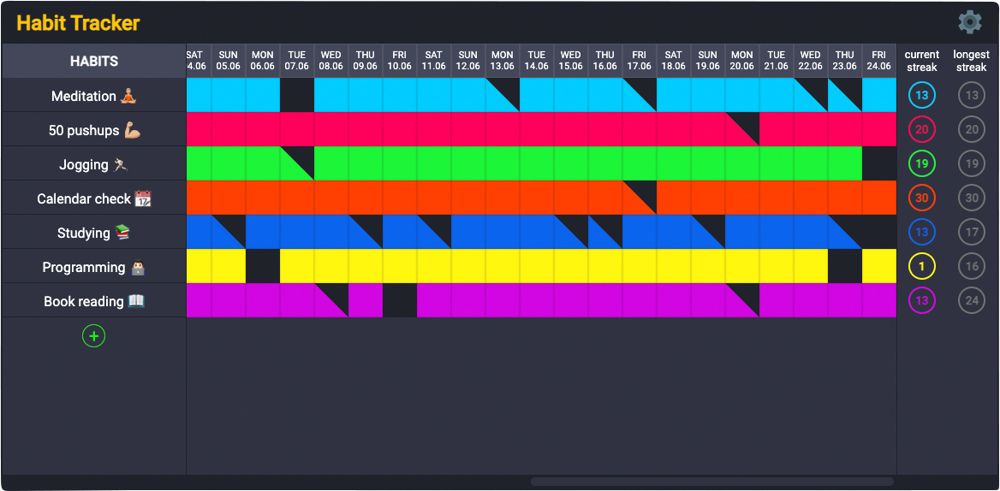

# Habit tracker: back-end

Track your habits. Add new ones and improve old ones.

## Table of contents
* [Demo](#demo)
* [General info](#general-info)
* [Technologies](#technologies)
* [Inspiration](#inspiration)

## Demo
Here is a working live demo: https://habit-tracker.networkmanager.pl/

## General info
This project is a server side application, made to track habits.
 
Front-end reposotiry - https://github.com/tomczer2t/habit-tracker-front
 
Main goals of this entire project was to practice making full-stack application with React.js and Node.js, practice JWT authentication and working with MySQL database.

## Technologies
Server side application is created with i.a.:
* typescript: 4.7.2,
* express: 4.18.1, 
* mysql2: 2.3.3,
* jsonwebtoken: 8.5.1, 
* bcrypt: 5.0.1

## Inspiration 
Application inspired by Everydy app - https://everyday.app/
